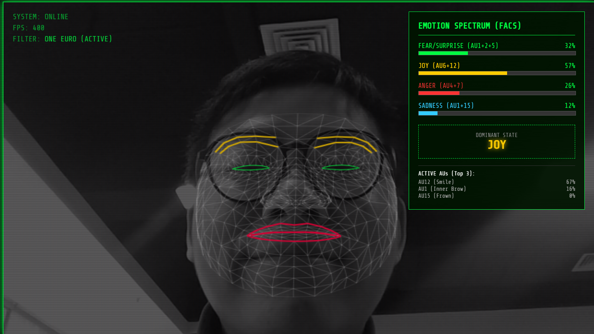

# Bio-Feedback Game Bridge (v3.0)


**[English](#-english-introduction) | [中文说明](#-中文介绍)**



---

<div id="english-introduction"></div>

## 📖 Introduction

**Bio-Feedback Game Bridge** is a real-time **Affective Computing Architecture** designed to bridge Web-based computer vision with game engines (Godot/Unity/Unreal). 

This project decouples heavy AI inference from the game loop by using the browser as an edge computing sensor. It captures granular facial micro-expressions using **MediaPipe**, stabilizes signals via a custom **One Euro Filter**, maps them to **FACS (Facial Action Coding System)**, and broadcasts emotional vectors through a low-latency **WebSocket Relay Server**.

> **Core Value:** Enables "Emotion-driven Gameplay" mechanics where game environments react dynamically to the player's real-world facial expressions (Joy, Anger, Fear, Sadness).

## 🏗 Architecture

```mermaid
graph LR
    A[Web Client / Edge] -->|Face Mesh & FACS| B(Signal Processing)
    B -->|One Euro Filter| C{JSON Payload}
    C -->|WebSocket Stream| D[Node.js Relay Server]
    D -->|Broadcast| E[Godot / Unity Client]
    D -->|Broadcast| F[Data Dashboard]

